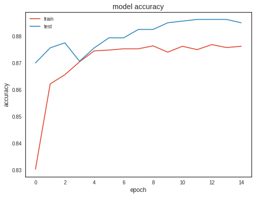
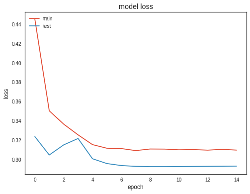

# Mortality-Prediction-in-ICU-using-ANN-89-percent
 

**The data used for the challenge consist of records from 12,000 ICU stays. ICU stays of less than 48 hours have been excluded.Up to 42 variables were recorded at least once during the first 48 hours after admission to the ICU. Some example of 42 variables for a patient are Cholesterol, TroponinI, pH, Bilirubin, etc. Feature selection has been very much focussed upon. Not all 42 variables were trained but a best set of selected features after trials of numerous sensible combinations to obtain maximum model performance and avoid overfitting. Used metrics like precision and recall along with accuracy and explained why precision is more significant than recall in a brief way. The model architecture has been tuned repeatedly and was tested for different hyperparameters to obtain an accuracy of 89 % and with a precision of 80 %.**
    
  
